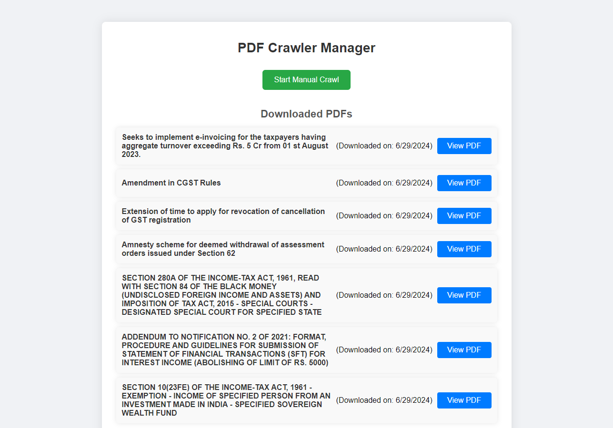

# PDF Crawler and Manager

This project is a Node.js application designed to periodically crawl the website `https://cleartax.in/v/tax-library`, detect new PDFs, download them, and store their metadata and content in a MySQL database using Sequelize. The application includes a simple web interface displaying the list of downloaded PDFs with their titles, download dates, and links to view the files. The interface also allows manual initiation of the crawling process and implements live updates via a socket connection.

## Screenshot


# Installation 

# 1) Clone the Repository
``` 
git clone https://github.com/karthik-s-s/pdf-crawler.git
cd pdf-crawler
```
# 2) insall dependency
``` npm install ```
# 3) Set up environment variables:
update values in .env file
``` 
DB_HOST=localhost
DB_USER=root
DB_PASSWORD=password
DB_NAME=pdf_crawler 
```

# 4) Database Configuration:
Ensure MySQL is installed and running.
Configure database settings in .env or adjust statically in models/pdfModel.js.

# 5) To start th app
### To start Without nodemon
``` 
npm start
```
### To start in development mode (with nodemon for auto-reloading)
```
npm run dev 
```

# 6)Access the application:
### Open your browser and go to http://localhost:3000 to view the application.
### Structure
```
pdf-crawler/
├── controllers/
│   └── pdfController.js
├── models/
│   └── pdfModel.js
├── routes/
│   └── pdfRoutes.js
├── services/
│   └── pdfService.js
├── utils/
│   └── crawler.js
├── public/
│   ├── index.html
│   └── styles/
│       └── main.css
├── server.js
├── .env
└── package.json
```